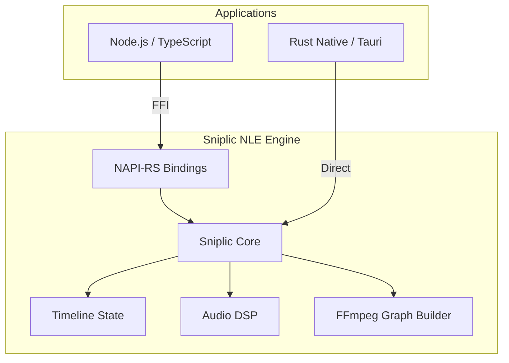

<div align="center">
  <h1>Sniplic Core</h1>
  <p><strong>A high-performance, headless Non-Linear Video Editing (NLE) engine.</strong></p>

  []()
  [](https://www.rust-lang.org)
  [](https://nodejs.org)
  []()
</div>

<br/>

## Overview
Sniplic Core is a memory-safe video editing engine designed to power modern media applications. It abstracts timeline state management, audio/video synchronization, and FFmpeg pipeline generation into a predictable API. 

Designed for both Systems Programming (Rust) and the Web Ecosystem (Node.js/TypeScript), it serves as the foundation for web-based video editors, automated rendering pipelines, and AI-driven media generators.

## Architecture
Sniplic is organized as a modular Cargo Workspace, isolating the intensive computation from the application's UI layer.



## FFmpeg Integration
Sniplic interacts with FFmpeg strictly via out-of-process CLI invocation (`std::process::Command`), building and piping complex filter graphs. There are no C/FFI bindings (e.g., `ffmpeg-next`). This prevents C-level segfaults from crashing the Rust engine and avoids GPL contamination.

## Core Features
- **Frame-Accurate Clock**: Strict `u64` frame-based timeline and hardware-synchronized Tokio playback to eliminate floating-point drift.
- **Agnostic & Headless**: 100% decoupled from UI frameworks. Runs as a background worker or binds directly to React, Vue, Tauri, etc.
- **Advanced Compositing**: Native parsing for visual filters, affine transforms, 3D LUTs, gapless tracking, and ripple editing.
- **Audio DSP Pipeline**: Built-in Equalization and Noise Reduction processing injected directly into the FFmpeg render graph.
- **Local AI Subtitles**: Deep ONNX Runtime integration for offline audio transcription and word-level timestamp generation *(Note: The engine is currently hardcoded exclusively to the local Parakeet v3 model. It does not support connecting to external providers or generic AIs out-of-the-box).*
- **Transactional Memory**: In-memory Undo/Redo history stacks for instant project state-switching without JSON overhead.

## Getting Started (Node.js / TypeScript)

Ideal for Next.js servers, Electron apps, or Node CLI tools.

### Installation
```bash
npm install sniplic
```

### Usage
```typescript
import { SniplicEngine } from 'sniplic';

async function main() {
    const engine = new SniplicEngine("TikTok Generator");
    await engine.setProjectConfig(1080, 1920, 60.0);

    await engine.importMedia("./raw_footage.mp4");
    await engine.addClipsBatch(["med_1234"], 0, null, true, null);

    await engine.setClipTransition("clip_1234", "fade", JSON.stringify({ duration_frames: 30 }));
    
    const settings = { video_codec: "libx264", audio_codec: "aac", bitrate_kbps: 8000 };
    engine.exportProject(JSON.stringify(settings), (err, progress) => {
        if (err) throw err;
        console.log(`[${progress.stage}]: ${progress.percentage.toFixed(1)}% `);
    });
}
```

## Getting Started (Rust)

For absolute maximum performance and system-level integration.

### Installation
```toml
[dependencies]
sniplic-core = { git = "https://github.com/magosam/sniplic.git", branch = "main" }
```

### Usage
```rust
use sniplic_core::core::project::Project;
use sniplic_core::playback::engine::PlaybackEngine;

#[tokio::main]
async fn main() {
    let mut project = Project::new("My Native NLE".into());
    let engine = PlaybackEngine::new();

    engine.set_on_frame_update(move |event| {
        println!("Frame: {} | Playing: {}", event.frame, event.is_playing);
    }).await;

    engine.play().await;
}
```

## License
This project is dual-licensed under either the MIT License or the Apache License, Version 2.0.
See the `LICENSE-MIT` and `LICENSE-APACHE` files for details.
